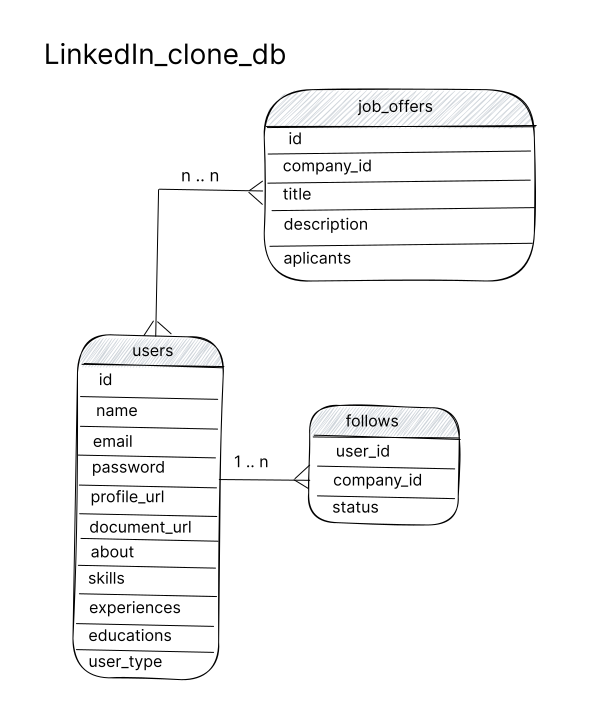
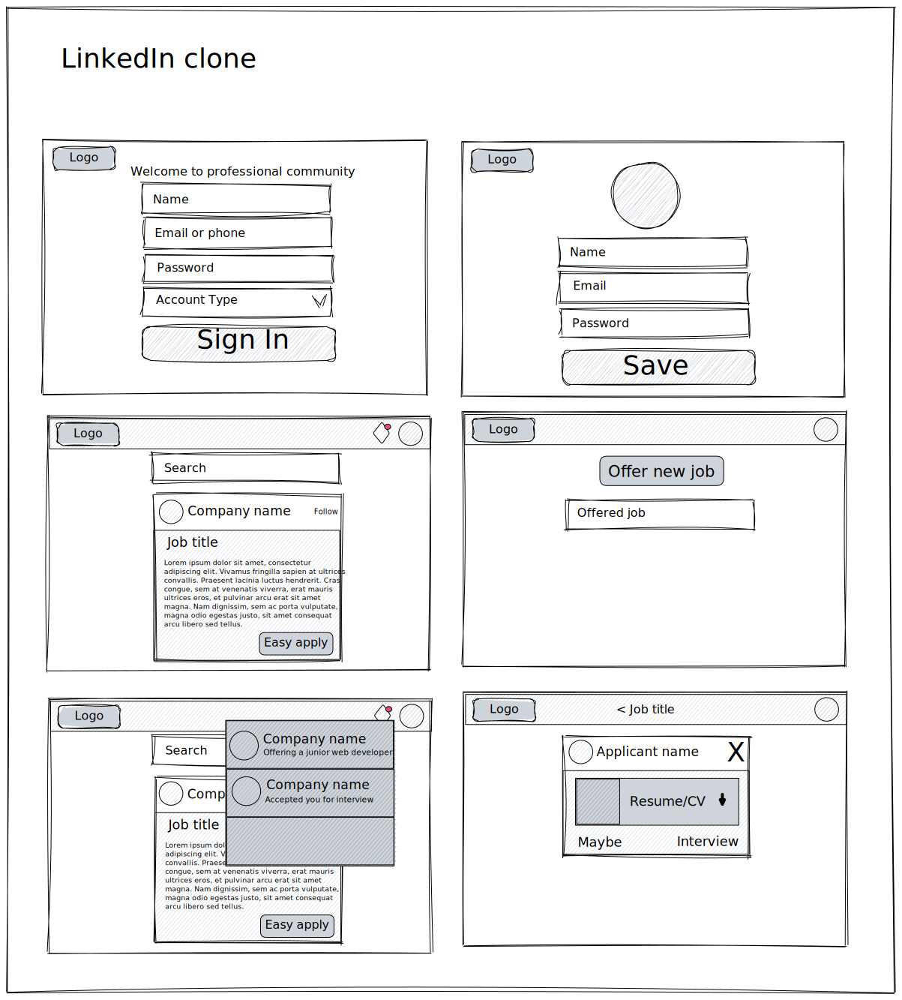
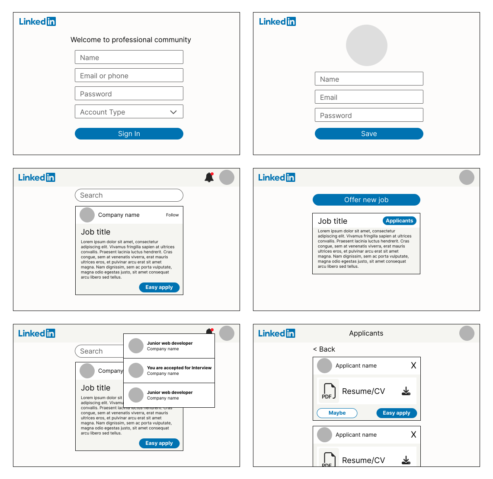
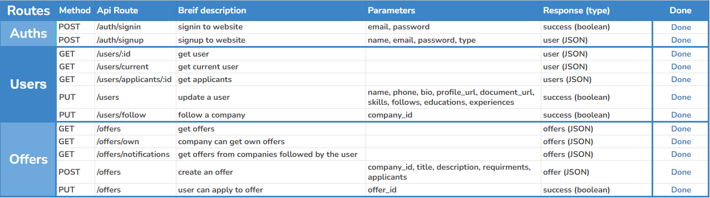
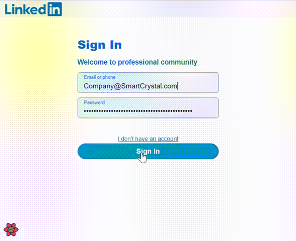
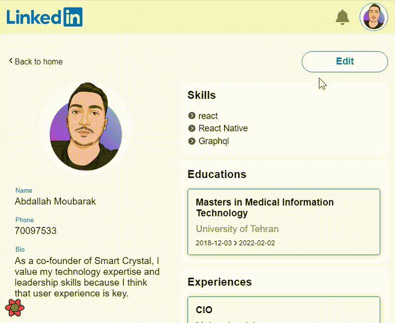
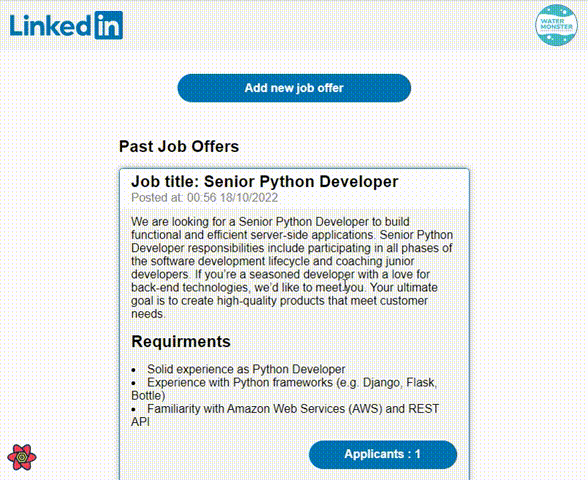

# Simple LinkedIn Clone

⭐ Implement a Linkedin clone, using React, Node.js, and MongoDB:

##### Stack:

---

#### 🎯 Requirements

- Users and Companies shall be able to Signup / Signin.
- Users shall be able to edit profile.
- Users shall be able to search for job offerings.
- Users shall be able to “easy apply” for jobs - their profiles are automatically then shared with the companies.
- Users shall be able to follow companies and receive notifications when new job offering is posted.
- Companies shall be to post job openings.
- Companies shall be able to review applicants.

---

## ✨TEAM Members

#### - Fullstack developer & Designer:

<a href='https://github.com/abdallahmoubarak'>Abdallah Moubarak

</a>

---

## 🎯 Project Process

#### Stage 1: Creating ER diagram for the project

Sketching a first version of ER diagram

---

#### Stage 2: Creating the project ui/ux design

##### - Sketching:

##### - Figma design:

---

#### Stage 3: Creating list of API's needed for the project

---

#### Stage 4: Creating main branch, and master bransh for the project

repo link : https://github.com/abdallahmoubarak/simple-linkedin-clone

- Substage 1 : developing frontend pages using (Reactjs)
- Substage 2 : implementing (Nodejs)
- Substage 3 : listing APIs
- Substage 4 : fitting API's in frontend (React-query)

---

#### Stage 5: Presenting the project

##### - Sign in process

##### - Adding job offer

##### - Editing profile

##### - Reviewing applicants

